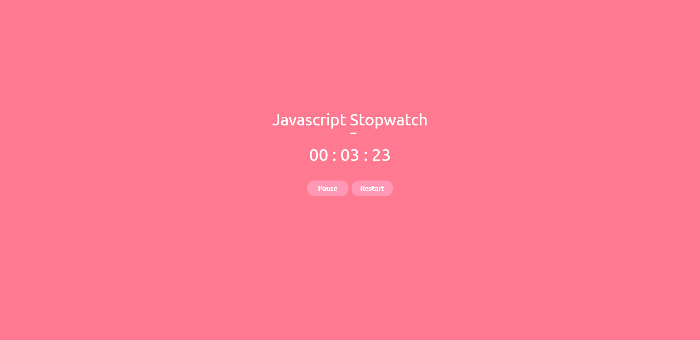

<h1 align="center">JAVASCRIPT STOPWATCH 🕒</h1>
<h3 align="center">SEE YOUR FINAL TIME OF SOME ACTIVITY</h3>

 

    

 

#### RELEASE NOTES: V1.0.0:
- First version of the project 🎉
- Use the stopwatch to find out how long it took to complete a certain activity

 

#### TECHNOLOGIES:
- HTML 📄
- CSS 🎨
- JAVASCRIPT 💻

 

<h5 align="center">Felipe Macci</h5>